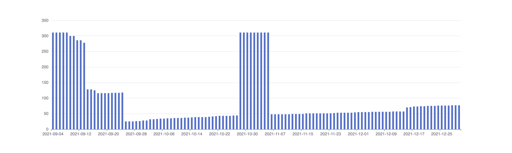

# Gemorama

This Rails project generates charts that visualize the number of outdated gems in Ruby projects over time. The charts display a timeline with the count of outdated gems for each date.



### System
  * Ruby (defined in .ruby-version file)
  * Node.js (defined in [package.json](https://classic.yarnpkg.com/en/docs/package-json/#toc-engines))
  * Yarn (defined in [package.json](https://classic.yarnpkg.com/en/docs/package-json/#toc-engines))

## Setup

Run:
```bash
./bin/setup
```

## Load Rubygems data

In order to use this app, you'll first need to seed your database with some Rubygems dumps. This can easily be done with:

```bash
script/load-pg-dump -d rails_infinum_gemorama_development -c ~/Downloads/public_postgresql.tar
```

## Generate chart

With everything set up, you can generate charts for your projects using the following command:

```bash
script/chart -f 2024-07-29 -t 2024-08-02 ~/Code/Projects/a-cool-rails-rails-project
```

If you need to specify a different branch, use the `-b` option.

For additional information about the `script/chart` options, run:

```bash
script/chart -h
```
